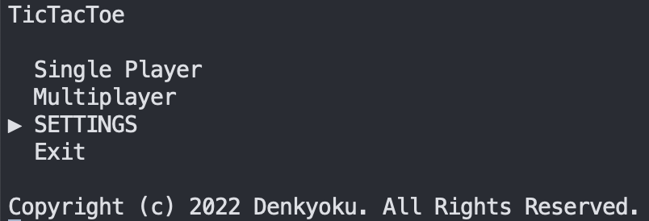
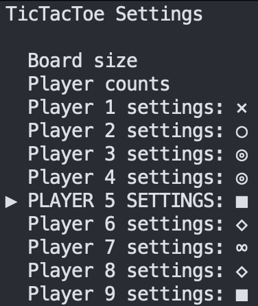
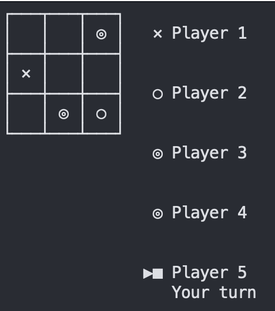
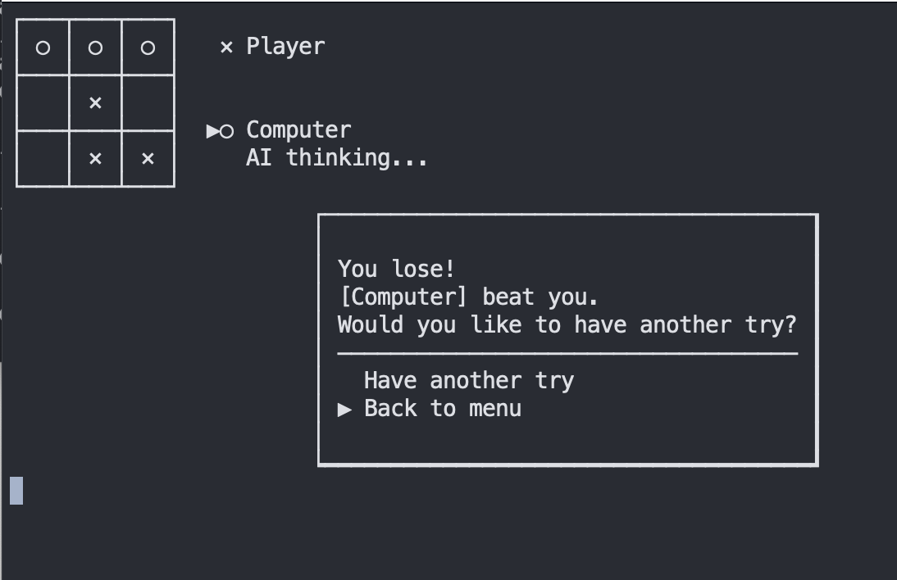
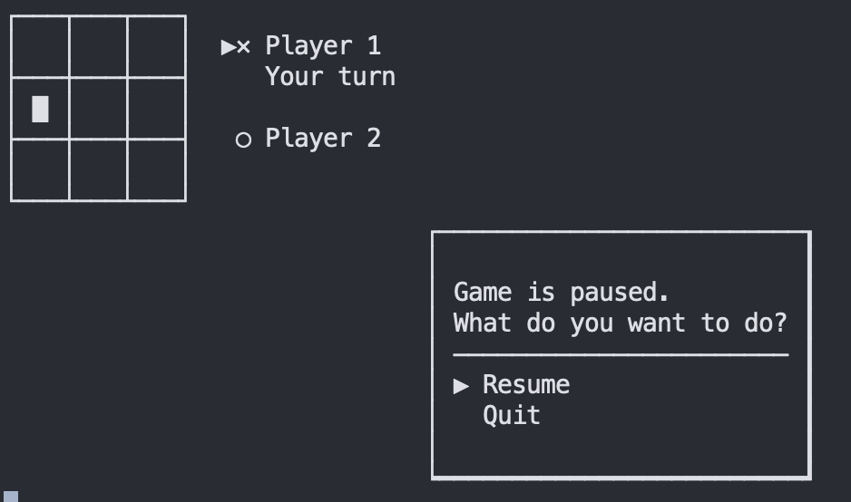
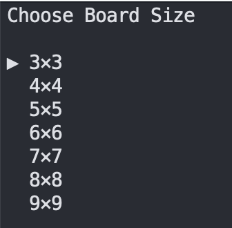
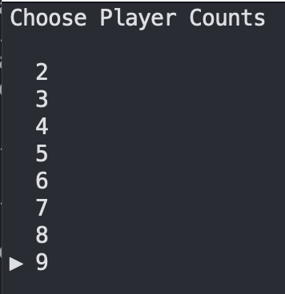
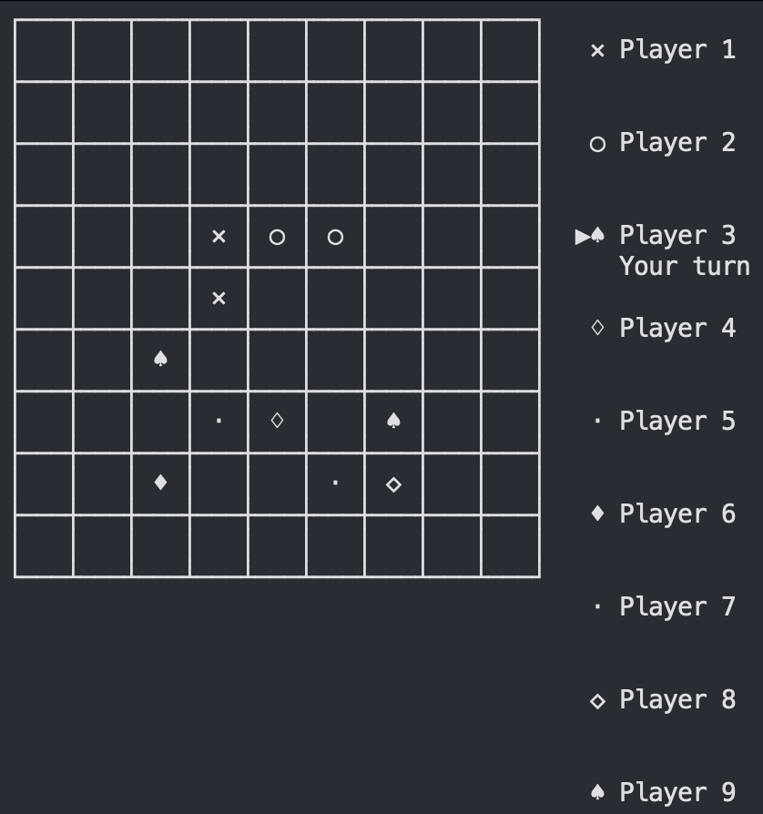

# Tic-Tac-Toe Readme

by Zhenghang Yin. 2022. Release under MIT License

Student Id: U82871437

> This is one of a series of assignments for the BU CS611 Java course. Because it is only for teaching evaluation, the original author is not responsible for any disputes and responsibilities arising from the use of this project.


### Compile and Run:

You must have at least Java 8 or OpenJDK 1.8 to build the project. Otherwise it's not guaranteed that it will work.

first clone this repo, and then inside the repo, type and enter:

```Bash
javac src/club/denkyoku/TicTacToe/*.java -d out/production/Tic-Tac-Toe

```


And to run:

```Bash
(cd out/production/Tic-Tac-Toe/ && java club.denkyoku.TicTacToe.Main)

```


### Features and Speciality:

#### Main Menu Theme:





The most commonly used interface in the game is called **Menu**. **Menu** is characterized by the fact that you can use the keyboard keys to select up/down, press Enter to enter, or press ESC to return to the previous menu.

#### Directly use up and down, left and right control to play



In the program, you can directly use the up, down, left and right keys to select and play without manually entering coordinates.
The details on this is implemented in `Game.java`. Actually, when a player has his turn, and game detected that it's not an AI player (which is a property defined in the player object), it will let user use kehys to play.

#### Dialog Interfaces





The game use Dialog interfaces to help player do what they want more quickly, without having to enter instructions or worry about entering wrong instructions. 

Use up and down keys to choose different options. Esc key can be used if the program letting you do so.

#### Customizing

The game letting you change board size or player counts.





Then you can make a super giant board, and play 9-In-a-Row game with friends.



#### An easy AI computer;

Notes: Without Deep learning, AI can only play with you when board size is $3\times3$.

